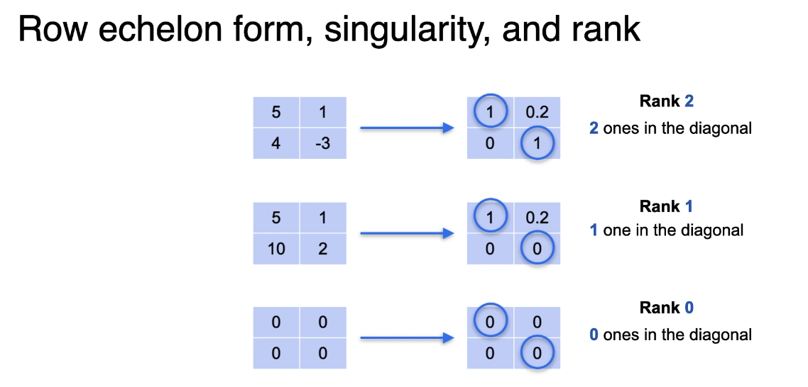
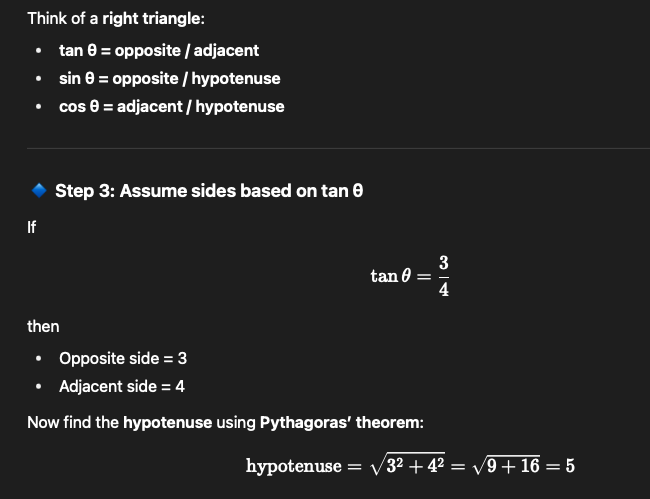

# Course 1: Linear Algebra for Machine Learning and Data Science - notes - course from deep learning.ai
link : https://learn.deeplearning.ai/specializations/mathematics-for-machine-learning-and-data-science

<details>
<summary>🎯Q. what is linear regression</summary>

- Its a `supervised machine learning algorithm` which collects data with input and output and then try to learn the relationship between inputs and outputs.
- It is `used for predicting continuous values`.
- Linear algebra `is all about manipulating vectors and matrices to do powerful calculations`.
- Linear regression `is all about finding the best fitting line` through a set of points in an n-dimensional space.
- Formula of linear regression is `y = mx + b` where m is slope and b is y intercept. ( m is also sometimes called as weight and b is called as bias)
</details>

<details>
<summary>🎯Q. what is singular vs non-singular system ?</summary>

- A `singular system` is a system of linear equations that does not have a unique solution. This happens when the equations are `linearly dependent`, meaning that one equation can be derived from another. In such cases, t`he system may have either no solutions or infinitely many solutions`.
- A `non-singular system` is a system of linear equations that has a unique solution. This occurs when the equations are `linearly independent`, meaning that no equation can be derived from another. In such cases, the `system has exactly one solution`.
- A `singular matrix`
- 
- 
- 

</details>


<details>
<summary>🎯Q. what is linear equation and non-linear equation ?</summary>

- 
- `linear equation` is an equation in which the highest power of the variable is 1. Example : 2x + 3y = 6
- `non-linear equation` is an equation in which the highest power of the variable is greater than 1. Example : x^2 + y^2 = 1
- `linear equations` can be represented in the form of `matrices and vectors`. Example : 2x + 3y = 6 can be represented as [2 3] [x y]^T = 6 (T here is transpose)
- `non-linear equations` cannot be represented in the form of matrices and vectors. Example : x^2 + y^2 = 1 cannot be represented as [x y]^T [x y] = 1
- `linear algebras` is all about the studying the linear equations and their properties.
- `non-linear algebras` is all about the studying the non-linear equations and their properties.   
    - `Algebra` is a branch of mathematics that uses mathematical statements to describe relationships between things that vary.
    - `Linear algebra` is a branch of algebra that studies linear equations, linear functions, and their representations through matrices and vector spaces.
    - `Non-linear algebra` is a branch of algebra that studies non-linear equations, non-linear functions, and their representations through various mathematical structures.
</details>

<details>
<summary>🎯Q. System of equations as a line ? very intresting</summary>

- 
- 
</details>

<details>
<summary>🎯Q. System of equations a metrics ? very intresting</summary>

- 
</details>

<details>
<summary>🎯Q. what does linear dependence system means?</summary>

- 
- 
-   
-  
- 
- 

</details>

<details>
<summary>🎯Q. what is determinant?</summary>

- determinant is a used to `determine if a matrix is singular or non-singular`.
- If determinant is `0` then matrix is `singular` and if determinant is `non-zero` then matrix is `non-singular`.
- 
- 
- 

</details>

<details>
<summary>🎯Q. Solving the system equation?</summary>

- 
- 

</details>

<details>
<summary>🎯Q. what is rank of a metrix?</summary>

- 
- 
- 
- 
</details>

<details>
<summary>🎯Q. what is row echelon form? how it helps find the rank ?</summary>

- echelon form is a form of a matrix in which all the non-zero rows are above the zero rows and the leading coefficient of each non-zero row is to the right of the leading coefficient of the previous row. 
- Example : A matrix in row echelon form might look like this:
  ```
  [1 2 3]
  [0 1 4]
  [0 0 1]
  ```
- 
- 
- 
- 
- 
- 
</details>

<details>
<summary>🎯Q. what is Gaussian Elimination Algorithm</summary>

- 
</details>


<details>
<summary>🎯Q. what is sin theta, cost theta and tan theta?</summary>

- 
- 
- sin theta, cost theta and tan theta are `trigonometric functions` that relate the angles of a triangle to the lengths of its sides.
- in linear algebra, these functions are used to `describe the relationship between vectors and angles`.
- `sin theta` is the ratio of the length of the side opposite the angle to the length of the hypotenuse.
- `cos theta` is the ratio of the length of the adjacent side to the length of
the hypotenuse.
- `tan theta` is the ratio of the length of the side opposite the angle to the length of the adjacent side.
- These functions are used in various applications such as `rotations, projections, and transformations` in linear algebra.
- They are also used in `machine learning and data science` for tasks such as `dimensionality reduction and feature extraction`.
</details>


<br>
<details>
<summary>🎯Q. what is the neural network ? VVIP</summary>

- 
</details>


<details>
<summary>🎯Q. what is L1 and L2 norms</summary>

- L1 and L2 norms used to measure the size or length of a vector in a vector space.

- 
- Machine Learning connection
  - `L1 norm` → gives sparse models (used in Lasso Regression)
  - `L2 norm` → gives smooth models (used in Ridge Regression)
- going by car is L1 and goinf by plan is L2. check below diagrm for simple analogy.
- 
</details>

<details>
<summary>🎯Q. The dot product geometry explained and equations of a dot product explained in simple</summary>

- 
- 
- 

- equations as a dot product
- 
- 
</details>


<br>
<br>
*********** IGNORE BELOW ***********
<details>
<summary>Emojis used</summary>
⭐ - For important points
🔥 - super important
💡 - For key concepts/tips
⚠️ - For warnings/common mistake
🎯 - For exam targets/focus areas/ question 
🚀 - For advanced topics .
🚫 - For indicating something that cannot be used or a concerning point
</summary>
</details>
