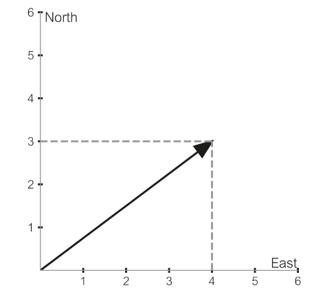
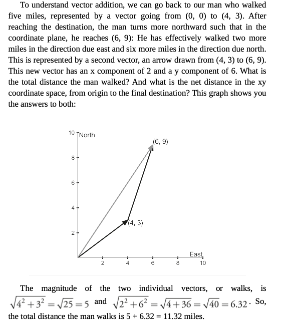
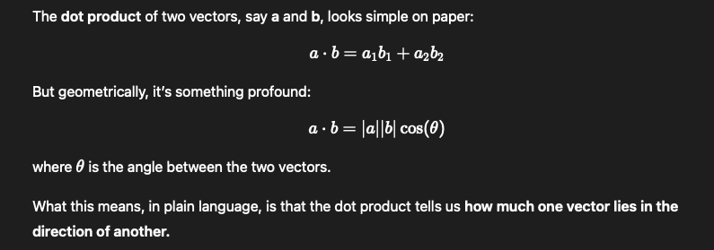
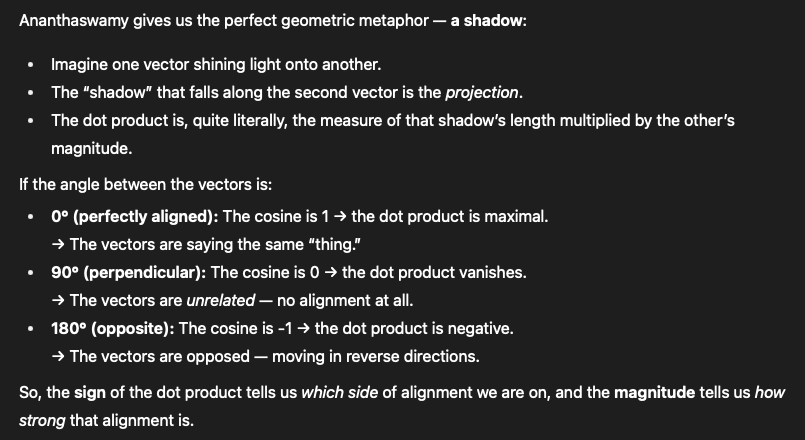
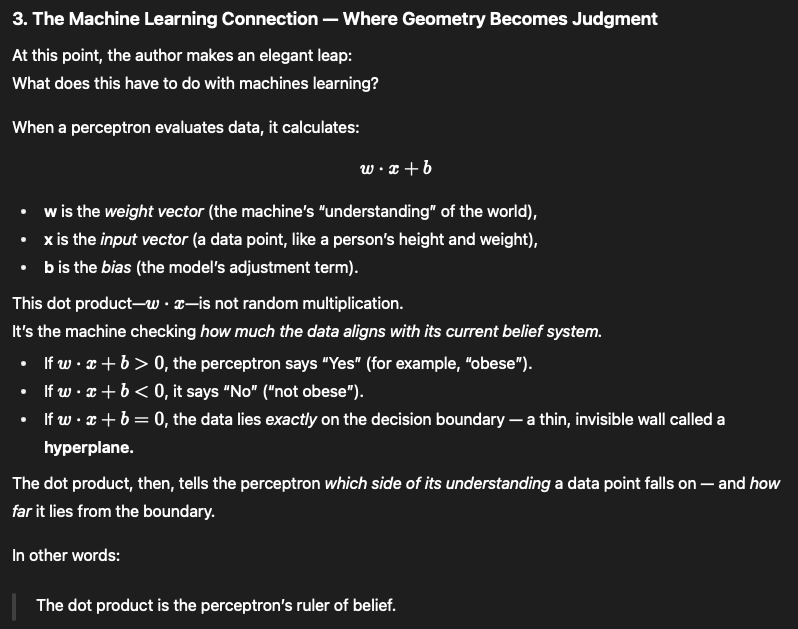
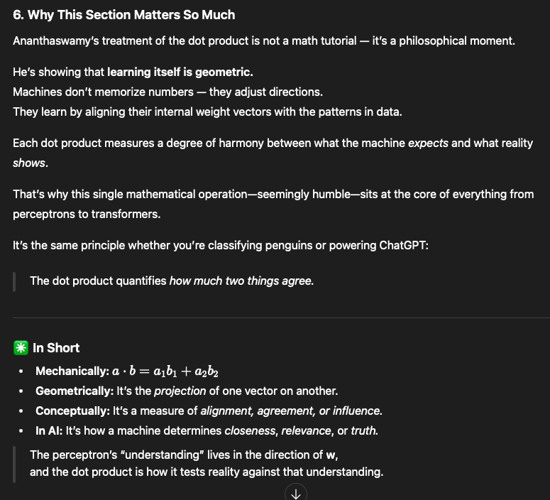
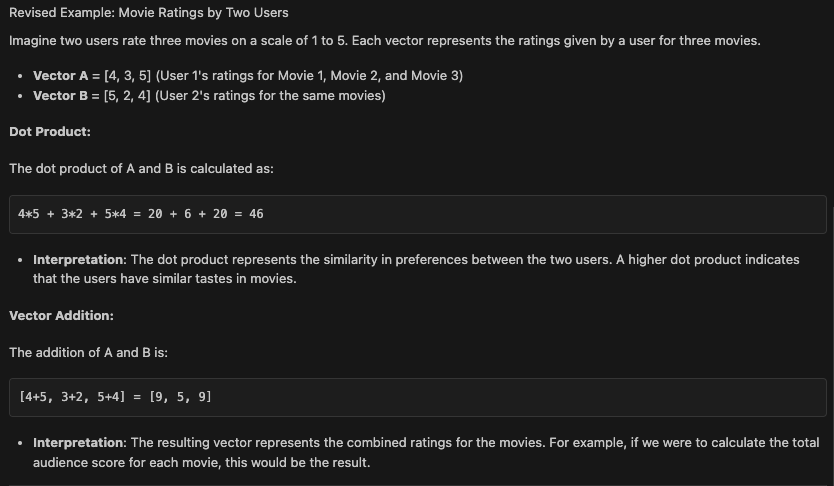

# book name : Why Machines Learn - by Anil Ananthaswamy

- This book aims to communicate the conceptual simplicity underlying ML and deep learning.


## Chapter 1 : Desperately Seeking Patterns

#### Desperately Seeking Patterns

- This section talks about the patterns and how both animals and machines learn by finding patterns in their environment.
- Ananthaswamy then introduces Frank Rosenblatt’s perceptron, the first algorithm that could learn such patterns from data. Like a digital neuron, it takes inputs, multiplies them by weights, and adjusts those weights whenever it makes a mistake — gradually learning to separate one kind of data from another.
- The chapter walks us through this process gently, showing how equations like y = w₁x₁ + w₂x₂ aren’t just dry math — they’re the language of learning. Once the perceptron finds the right weights, it can predict outcomes for new, unseen examples. This is the essence of supervised learning, the foundation of modern AI.


#### THE FIRST ARTIFICIAL NEURON
- In this section author talks about how the firt neuron was created and how it worked by actually simulating the way a biological neuron works.
- Scientist were able to make the model learn by using AND, OR , NOT logic gates, meaning that the model was able to learn the patterns by adjusting the weights using either of the logic gates. ( before this the weights were adjusted manually). This was groundbreaking as it was the first time a machine was able to learn from data by itself.

#### LEARNING FROM MISTAKES
- let a machine make a prediction, check whether it’s right, and if it’s wrong, nudge the machine so it’s a bit less wrong next time. This cycle — predict, compare with truth, update — is the heart of the perceptron and of many learning algorithms that followed.
- Author explains the simple linear regression with great relatable details.
- `Linear regression` is the idea of `finding a straight-line rule that best explains a set of (x, y) points.`
- a single neuron computes `y^=wx+b` where w is the slope (weight) and b is the offset (bias). 
- Training means finding the right values of w and b so that ŷ is as close as possible to the actual y values for all training points.
- Given a few example points (x, y), we want w and b so that the line ŷ is as close as possible to the actual y values for all training points. `This is the essence of regression: discover the hidden linear rule that maps input x → output y.`


## Chapter 1 : We Are All Just Numbers Here

<details>
<summary>what is scaler and vector? super simple analogy</summary>

- Consider a man who walks five miles. Given that statement, the only thing we can say about what the man did is denoted by a single number: the distance walked. This is a scalar quantity, a stand-alone number. Now, if we were told that the man walked five miles in a northeasterly direction, we would have two pieces of information: the distance and the direction. This can be represented by a vector. A vector, then, has both a length (magnitude) and a direction.

- 
- understand the vector addition below 
- 


</details>


<details>
<summary>What are matrices and tensors? Extending the scalar and vector analogy</summary>

- **Scalar**: As explained earlier, a scalar is a single number. For example, the distance a man walks (5 miles) is a scalar quantity.

- **Vector**: A vector adds direction to the scalar. For instance, if the man walks 5 miles northeast, this can be represented as a vector with both magnitude (5 miles) and direction (northeast).

- **Extending to Matrices**:  
    Now, imagine that instead of just one man walking, we have a group of people walking in different directions and covering different distances.  

    For example:  
    - Person A walks 5 miles northeast.  
    - Person B walks 3 miles south.  
    - Person C walks 7 miles west.  

    To represent this group of movements, we can organize their distances and directions into a matrix. A matrix is essentially a table of numbers, where each row represents a person, and each column represents a specific aspect of their movement (e.g., distance and direction).  

    ```
    [ 5   NE ]
    [ 3    S ]
    [ 7    W ]
    ```

    In mathematical terms, we often break down the direction into components (e.g., x and y coordinates). For instance:  
    ```
    [ 5   3 ]
    [ 3  -3 ]
    [ 7   0 ]
    ```

    A **matrix is simply a collection of vectors organized in rows or columns**. It allows us to represent multiple pieces of information compactly.

- **Now let’s see what tensors are, keeping the same analogy**:  
    Let’s take it one step further. Imagine that instead of just tracking the distance and direction for each person, we also want to track additional information, such as:  
    - The time it took each person to walk.  
    - The terrain they walked on (e.g., flat, uphill, downhill).  

    To represent this richer dataset, we need a structure that can hold multiple matrices. This is where tensors come in. A tensor is a generalization of scalars, vectors, and matrices to higher dimensions.  

    **Example Tensor**:  
    - For Person A:  
        - Distance: 5 miles  
        - Direction: Northeast  
        - Time: 1 hour  
        - Terrain: Flat  
    - For Person B:  
        - Distance: 3 miles  
        - Direction: South  
        - Time: 0.5 hours  
        - Terrain: Uphill  
    - For Person C:  
        - Distance: 7 miles  
        - Direction: West  
        - Time: 2 hours  
        - Terrain: Downhill  

    This data can be represented as a 3D tensor, where each "slice" of the tensor corresponds to a specific attribute (distance, direction, time, terrain).

- **Summary**:  
    - **Scalar**: A single number (e.g., distance walked by one person).  
    - **Vector**: A collection of numbers representing magnitude and direction (e.g., distance and direction for one person).  
    - **Matrix**: A 2D grid of numbers representing multiple vectors (e.g., distances and directions for multiple people).  
    - **Tensor**: A multi-dimensional array of numbers representing even more complex data (e.g., distances, directions, times, and terrains for multiple people).

</details>


<details>
<summary>what is dot products? why they are important in machine learning?</summary>

- Dot products isnt just a dry math its at the heart of the how machines learn the relationship between different things(informations).
- 
- Think of it like this: imagine you're standing under a streetlight at night, and your shadow falls onto the ground. The dot product is like measuring how long that shadow is when one vector casts its "shadow" onto another vector.
- 
- 
- 

</details>

</br>
</br>
</br>
</br>
</br>
</br>

⭐⭐⭐⭐⭐⭐⭐⭐ Key points and my understanding ⭐⭐⭐⭐⭐⭐⭐⭐

- simple vector is like an infomration plotted on a graph by its number prepresentation for better visualization on the graph.
- scaler is a single number representation of the information.
- vector is a collection of numbers representing the information.
- dot product represent the similarity between two vectors. (provides the relationship between two information)
- addition of two vectors represent the combination of two information.

<details><summary>dot product and addition of vectors real world example</summary>

- ⭐⭐⭐⭐Example⭐⭐⭐⭐ 
- (VVIP very intresting example) 
- 
</details>